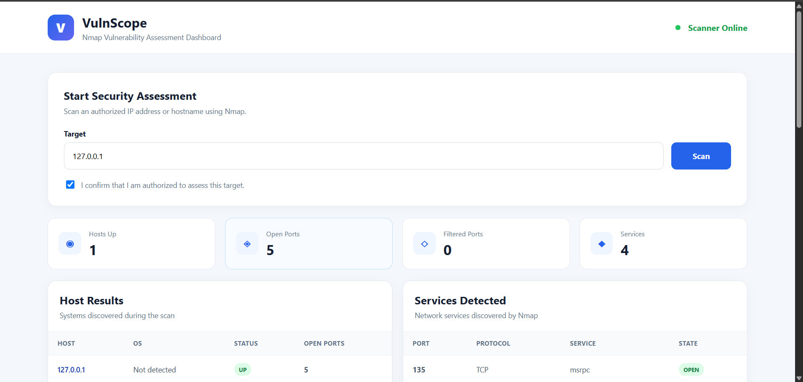
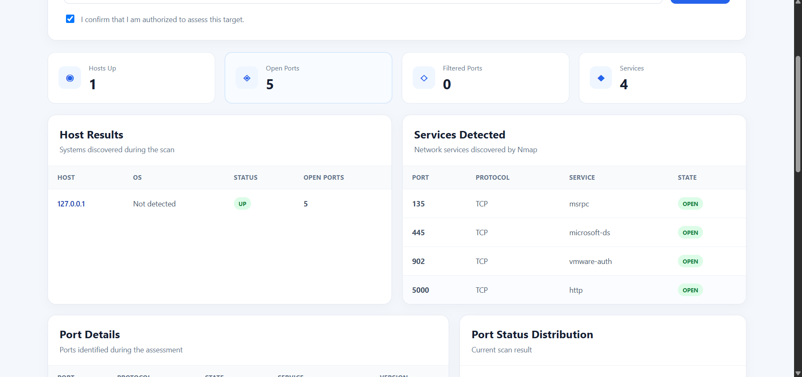
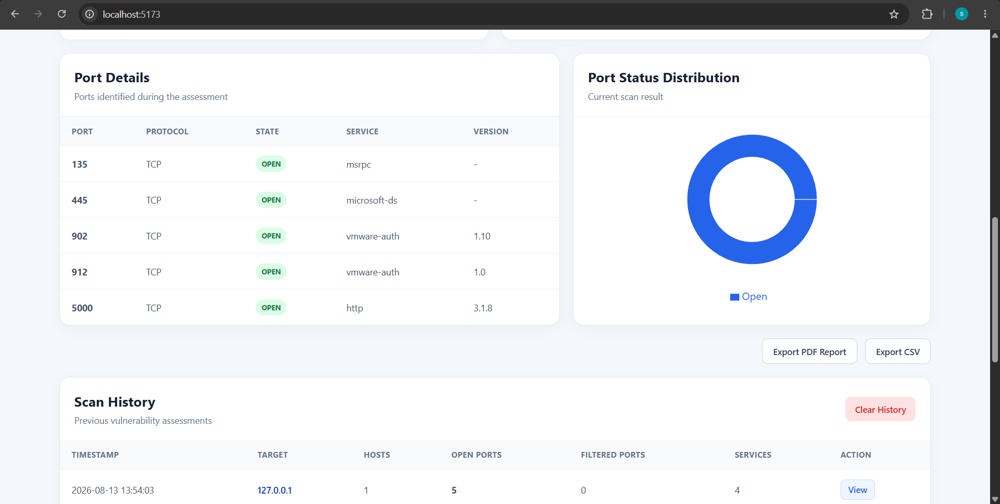
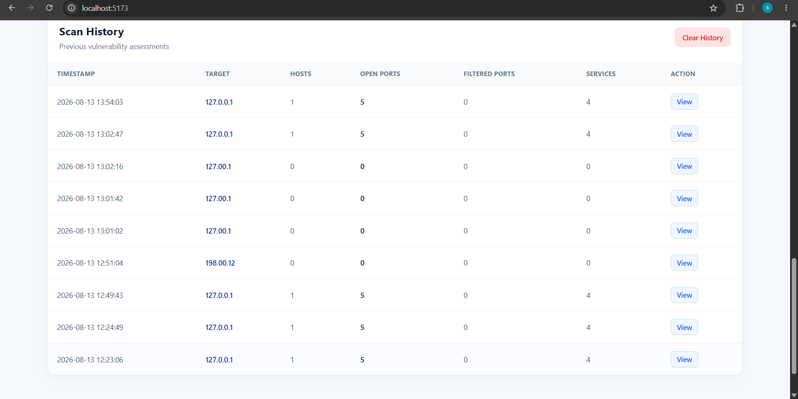
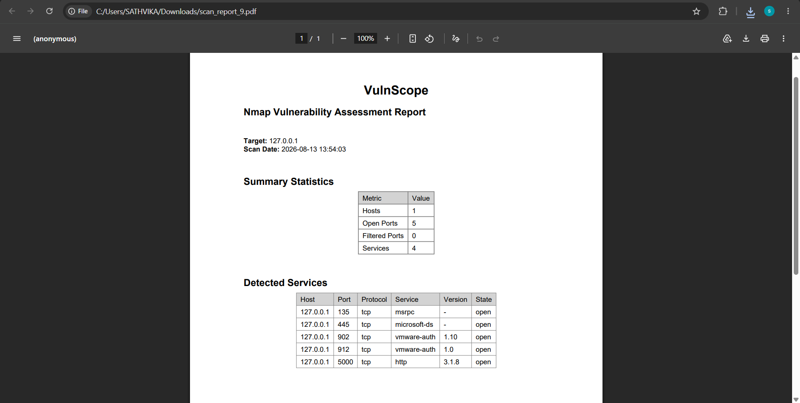

#  VulnScope – Vulnerability Assessment Dashboard

VulnScope is a web-based vulnerability assessment dashboard designed to simplify network scanning and security assessment using **Nmap**.

It provides a clean and user-friendly dashboard for scanning **authorized IP addresses, hostnames, and CIDR networks**, viewing discovered hosts, open ports, filtered ports, detected services, scan history, and generating scan reports.

>  **Authorization Notice:** VulnScope should only be used to scan systems and networks that you own or have explicit permission to assess.

---

##  Features

-  Nmap-based network scanning
-  Scan IP addresses, hostnames, and CIDR networks
-  Host discovery and status detection
-  Open port detection
-  Filtered port detection
-  Service and version detection
-  Scan summary statistics
-  Scan history
-  Scan report generation
-  CSV export
-  Clear scan history
-  Authorization confirmation before scanning
-  Responsive web interface
-  React frontend with Flask backend

---

## 📸 Screenshots

###  Dashboard

.

###  scan View



###  portstatus Interface



###  Scanhistory Results



###  Scanreport Details



---

##  Technologies Used

### Frontend
- React.js
- Vite
- HTML
- CSS
- JavaScript

### Backend
- Python
- Flask
- SQLite

### Security Tool
- Nmap

### Other
- REST API
- Flask-CORS
- XML Parsing

---

##  Project Structure

```text
VulnScope/
│
├── backend/
│   ├── app.py
│   ├── scanner.py
│   ├── database.py
│   ├── report.py
│   ├── requirements.txt
│   └── venv/
│
├── frontend/
│   ├── src/
│   │   ├── App.jsx
│   │   ├── main.jsx
│   │   └── index.css
│   ├── package.json
│   └── vite.config.js
│
├── screenshots/
│   ├── dashboard.png
│   ├── dashboard2.png
│   ├── scan.png
│   ├── scan2.png
│   └── scan3.png
│
└── README.md
